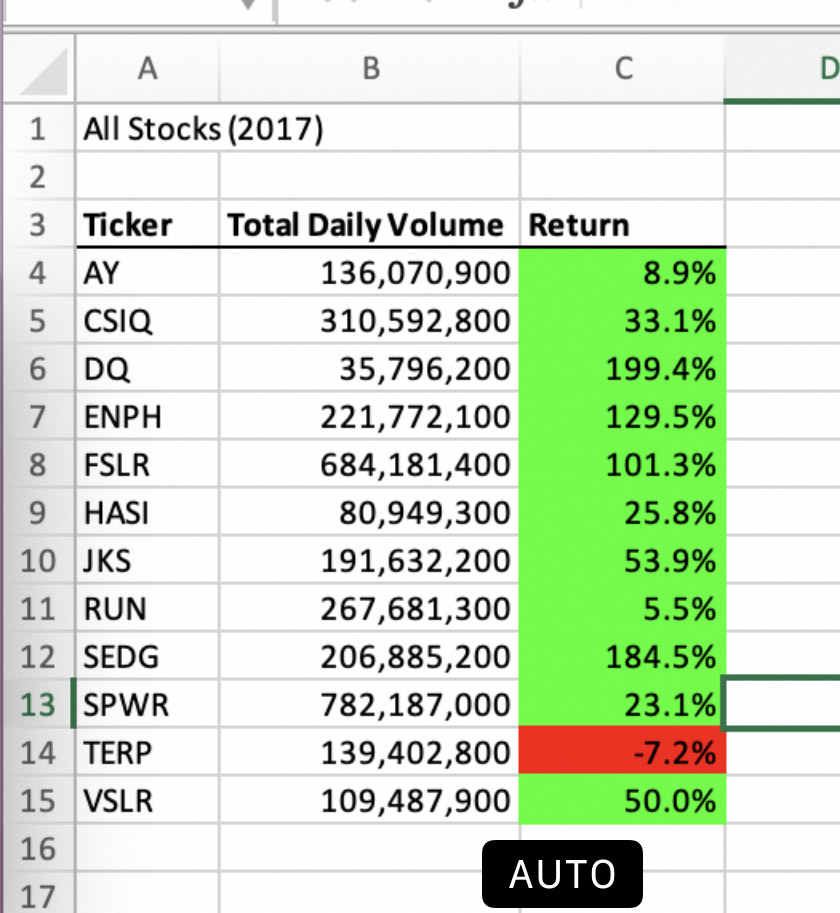
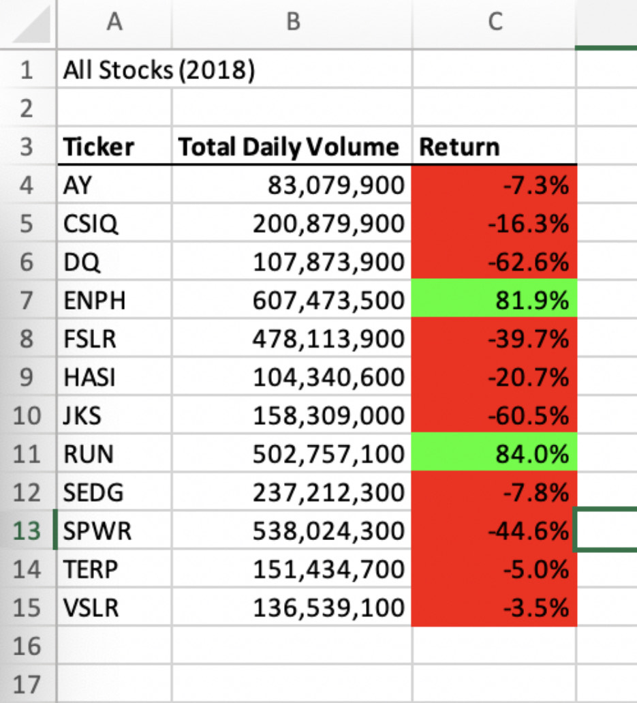

# stock-analysis

## Overview of Project

### Purpose

The purpose of this challenge is to refactor the code to be able to analyze a large portion of stock data in a faster and more efficient way by looping through all the data one time.

### Background Information

A customer provided a dataset containing the stock information (ticker value, the stock issuing date, opening/closing/adjusted closing and highest/lowest prices, the volume) for the years of 2017 and 2018. An initially written code was functional in evaluating a small number of stocks, however, might appear to be inefficient and time consuming in analyzing large quantities of stocks. Thus, we have been asked to defactor the current code to accommodate larger stock datasets. 

## Results

The final analysis of the stock datasets for 2017 and 2018 years revealed higher Total Daily Volume for most of the stock trading in 2017, thus, leading to growth/higher returns at the end of the calendar year. The Total Daily Volume significantly dropped in 2018 resulting in substantial financial losses. There were only two stocks that had showed a higher total daily volume and a growth/higher return in 2018. 

Please see the tables below. Growth is shown in green and losses are shown in red. 

Stock Data for 2017

Stock Data for 2018

### Code Refactoring

During the process of refactoring the code, the nested loop was eliminated, thus, decreasing the time required to analyze large datasets of stocks and making the process more efficient.  The refactored code ran in 0.074 and 0.070 in 2017 and 2018, respectively. The code ran faster as it was looped through the data once to collect information. 

 
    RowCount = Cells(Rows.Count, "A").End(xlUp).Row
    
    '1a) Create a ticker Index
        Dim tickerIndex as Integer 
            tickerIndex=0
            
    '1b) Create three output arrays   
        Dim tickerVolumes(12) as Long
        Dim tickerStartingPrices(12) as Single
        Dim tickerEndingPrices(12) as Single
    
    ''2a) Create a for loop to initialize the tickerVolumes to zero. 
        For Count= 0 to 11
            tickerVolumes(Count)=0

            Next Count
        
    ''2b) Loop over all the rows in the spreadsheet. 
    For i = 2 To RowCount
    
        '3a) Increase volume for current ticker
            tickerVolumes(tickerIndex)=tickerVolumes(tickerIndex)+Cells(i,8).Value
        
        '3b) Check if the current row is the first row with the selected tickerIndex.
        'If  Then
            If Cells(i-1,1).Value<>tickers(tickerIndex) Then
                 tickerStartingPrices(tickerIndex)=Cells(i,6).Value
            
            End If
        
        '3c) check if the current row is the last row with the selected ticker
         'If the next row’s ticker doesn’t match, increase the tickerIndex.
        
         If Cels(i+1,1).Value<>tickers(tickerIndex) Then
            tickerEndingPrices(tickerIndex)=Cells(i,6).Value      
 
        '3d) Increase the tickerIndex. 

            tickerIndex=tickerIndex+1

        End If      
    
    Next i
    
    '4) Loop through your arrays to output the Ticker, Total Daily Volume, and Return.
    For i = 0 To 11
        
        Worksheets("All Stocks Analysis").Activate
        Cells(4+i,1).Value=tickers(i)
        Cells(4+i,2).Value=tickerVolumes(i)
        Cells(4+i,3).Value=tickerEndingPrices(i)/tickerStartingPrices(i)-1
        

## Summary

### Advantages and Disadvantages 

The advantage of refactoring the code is to make the program simpler, faster and more user friendly. Refactoring allows for elimination of any issues/bug fixes as well as adding new features to the program and/or accommodating larger datasets, like in our case. 

The disadvantage of refactoring the code is the amount of time that might be necessary to make the code cleaner, more organized and fix any current errors. Another disadvantage is the possibility of introducing new errors.  

### Pros and Cons

The pros of refactoring the original VBA script include faster processing time and the ability to accommodate larger datasets. 

The cons of refactoring the original VBA code are the amount of time we have spent to revise it and make sure it is up and running. 

 

